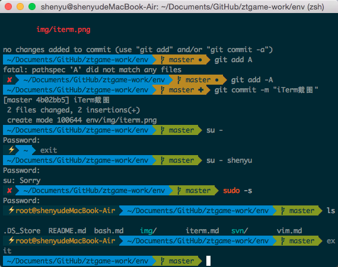

# iTerm

*Mac* 自带的 *Terminal* 很渣，而且对终端和 *Vim* 配色自定义的支持很差，*iTerm* 正好弥补了这个问题，当然没有软件是完美的，*iTerm* 也又它的 **Bug** 和不足，之后指出。

## 安装 iTerm

* 去[官网](http://www.iterm2.com)下载 Stable 版本的 *iTerm*

* 解压下载完的 zip 文件

* 将解压出来的 *iTerm2* 文件移动至 `/Applications/` 文件夹中

## 偏好设置

* 使用快捷键显示/隐藏 *iTerm*

	`Preferences` -- `Keys`，勾选 `Show/hide iTerm2 with a system-wide hotkey`

* 不限回滚

	`Preferences` -- `Profiles` -- `Terminal`，勾选 `Unlimited scrollback`

* 不隐藏标签页数字

	`Preferences` -- `Appearance`，取消勾选 `Hide tab number and tab close button`

* 不显示窗口序号

	`Preferences` -- `Appearance`，取消勾选 `Show window number`

* 隐藏标签页活动指示器

	`Preferences` -- `Appearance`，勾选 `Hide tab activity indicator`

* 使用 *Solarized* 主题

	* 安装 *Solarized* 主题
		
		* `git clone https://github.com/altercation/solarized.git`
		
		* 在 *Finder* 中打开目录 `solarized/iterm2-colors-solarized`

		* 双击 `Solarized Dark.itermcolors` 安装 *Solarized* 主题至 *iTerm*
	
	* 设置 *Solarized* 主题
	
		`Preferences` -- `Profiles` -- `Colors`，点击 `Load Presets`，选中 `Solarized Dark`

* 非ASCII字体设置为 *Inconsolata for Powerline*

	这个字体的设置和 *Oh My Zsh* 的 `angoster` 主题以及 *Vim* 的 `airline` 插件有关

	* 安装 *Powerline* 字体
		
		* `git clone https://github.com/powerline/fonts.git`
		
		* `cd font`
		
		* `./install.sh` （取保又执行权限）

	* `Preferences` -- `Profiles` -- `Text`，点击在 `Non-ASCII Font` 栏的 `Change Font`，选中 `Inconsolata for Powerline` 字体

# 缺憾Bug

使用安装了 *airline* 插件的 *Vim*，切换到 *Vim* 的普通模式，当 *iTerm* 窗口最大化/最小化或者长按 `Command` 键呼出 *Tab* 时会出现很难看的瞬间，自己去体验一下吧，希望 *iTerm* 开发团队能尽快解决这个缺陷。
