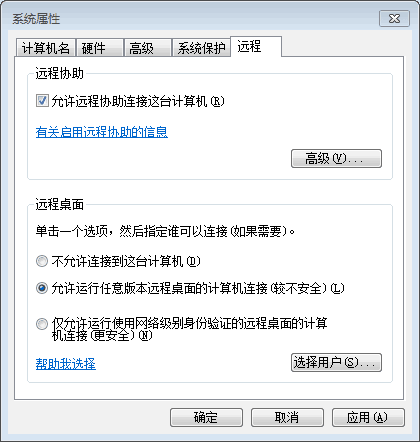
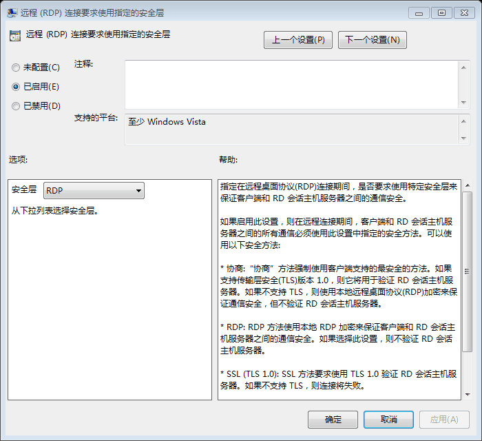

# Mac 局域网远程桌面连接 Windows

## 安装 Microsoft 远程桌面连接

下载地址：[Microsoft 远程桌面连接客户端 For Mac 2.1.1](https://www.microsoft.com/zh-cn/download/details.aspx?id=18140)

## Windows 设置允许远程连接

* 右击 `计算机`，选择 `属性`
* 点击 `高级系统设置`，切换到 `远程` 选项卡
* 勾选 `允许远程协助连接这台计算机`，并勾选 `允许运行任意版本远程桌面的计算机连接（较不安全）`

## Windows 配置远程连接协议

* `开始` -> `运行`，输入 `gpedit.msc` 回车，打开组策略编辑器
* 进入 `计算机配置` -> `管理模板` -> `远程桌面服务` -> `远程桌面会话主机` -> `安全`
* 打开 `远程（RDP）连接要求使用指定的安全层`，勾选 `已启用`，选项中安全层勾选 `RDP`

